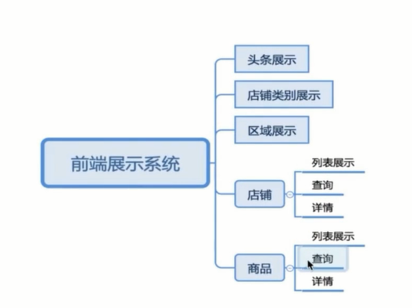
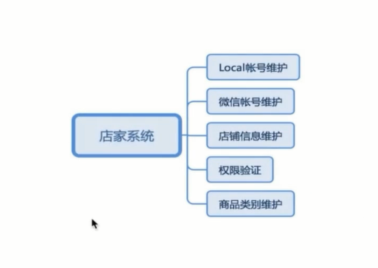
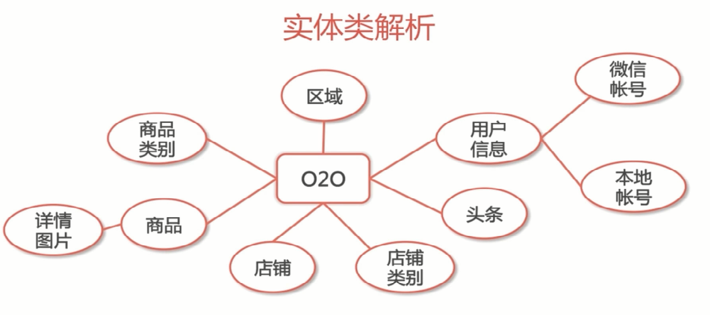

SSM框架项目

(！！！！！！！spring配置真的烦)

1. 模块划分

2. 实体类划分

参考博客:

[1.idea配置maven](http://blog.csdn.net/mr_ooo/article/details/53871828)

[2.idea配置tomcat启动项目](https://www.cnblogs.com/Fly-Bob/p/7240153.html)

[3.数据库连接池原理](http://blog.csdn.net/shuaihj/article/details/14223015)

[4.ssm框架配置文件详解](http://blog.csdn.net/baidu_32739019/article/details/73928040)